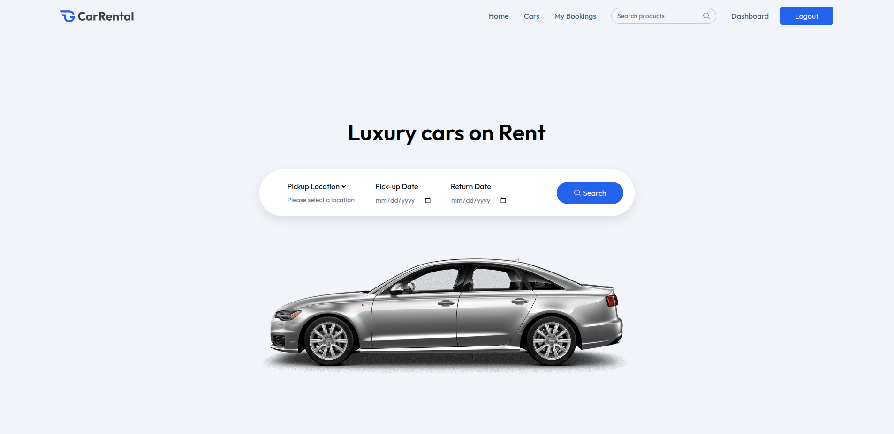

# Car Rental - Aplicação de Aluguel de Carros de Luxo



**Car Rental** é uma aplicação completa para aluguel de carros de luxo, dividida em dois componentes principais: o **frontend** (cliente) e o **backend** (servidor). Este documento abrange a configuração e as funcionalidades de ambos os módulos.

## Visão Geral

A aplicação permite aos usuários navegar por uma lista de carros de luxo, alugá-los e gerenciar suas reservas. Proprietários de carros podem listar seus veículos e acompanhar as reservas por meio de um painel administrativo.

-----

## Frontend

O cliente do projeto foi desenvolvido utilizando **React**, **Vite** e **TailwindCSS**, com integração ao backend via **Axios**.

### Requisitos

  - **Node.js** (versão 16 ou superior)
  - **NPM** ou **Yarn**

### Instalação

1.  Clone o repositório e navegue até a pasta do cliente:

    ```bash
    git clone <URL_DO_REPOSITORIO>
    cd client
    ```

2.  Instale as dependências:

    ```bash
    npm install
    ```

3.  Crie um arquivo `.env` na raiz do diretório `client` e adicione as variáveis de ambiente:

    ```env
    VITE_CURRENCY=$
    VITE_BASE_URL=http://localhost:3000
    ```

4.  Inicie o servidor de desenvolvimento:

    ```bash
    npm run dev
    ```

    A aplicação estará disponível em `http://localhost:5173`.

### Scripts Disponíveis

  - `npm run dev`: Inicia o servidor de desenvolvimento.
  - `npm run build`: Gera a build de produção.
  - `npm run preview`: Visualiza a build de produção.
  - `npm run lint`: Executa o linter para verificar erros no código.

-----

## Backend

O servidor foi desenvolvido utilizando **Node.js**, **Express** e **MongoDB**, com autenticação **JWT** e integração com o **ImageKit** para upload de imagens.

### Requisitos

  - **Node.js** (versão 16 ou superior)
  - **MongoDB** (local ou em nuvem)
  - **ImageKit** (para upload de imagens)

### Instalação

1.  Clone o repositório e navegue até a pasta do servidor:

    ```bash
    git clone https://github.com/pedrocasseb/Car-Rental.git
    cd server
    ```

2.  Instale as dependências:

    ```bash
    npm install
    ```

3.  Crie um arquivo `.env` na raiz do diretório `server` e adicione as variáveis de ambiente, substituindo os valores pelos seus:

    ```env
    PORT=3000
    MONGODB_URI=<SUA_URL_DO_MONGODB>
    JWT_SECRET=<SUA_CHAVE_SECRETA>
    IMAGEKIT_PUBLIC_KEY=<SUA_CHAVE_PUBLICA_IMAGEKIT>
    IMAGEKIT_PRIVATE_KEY=<SUA_CHAVE_PRIVADA_IMAGEKIT>
    IMAGEKIT_URL_ENDPOINT=<SEU_ENDPOINT_IMAGEKIT>
    ```

4.  Inicie o servidor:

    ```bash
    npm run server
    ```

    O servidor estará disponível em `http://localhost:3000`.

### Scripts Disponíveis

  - `npm run server`: Inicia o servidor em modo de desenvolvimento com `nodemon`.
  - `npm start`: Inicia o servidor em modo de produção.

-----

## Principais Funcionalidades da API

### Rotas de Usuário

  - `POST /api/user/register`: Registro de novos usuários.
  - `POST /api/user/login`: Login de usuários.
  - `GET /api/user/data`: Retorna os dados do usuário autenticado.
  - `GET /api/user/cars`: Lista todos os carros disponíveis.

### Rotas de Proprietário

  - `POST /api/owner/add-car`: Adiciona um novo carro.
  - `GET /api/owner/cars`: Lista os carros do proprietário.
  - `GET /api/owner/dashboard`: Retorna dados do dashboard do proprietário.

### Rotas de Reservas

  - `POST /api/booking/create`: Cria uma nova reserva.
  - `GET /api/booking/user`: Lista as reservas do usuário.
  - `GET /api/booking/owner`: Lista as reservas do proprietário.

-----

## Contribuição

Contribuições são bem-vindas\! Se você deseja ajudar a melhorar o projeto, siga os passos abaixo:

1.  Faça um fork do repositório.
2.  Crie uma nova branch para sua feature: `git checkout -b minha-feature`.
3.  Commit suas alterações: `git commit -m "Adiciona minha feature"`.
4.  Envie para o repositório remoto: `git push origin minha-feature`.
5.  Abra um **Pull Request**.